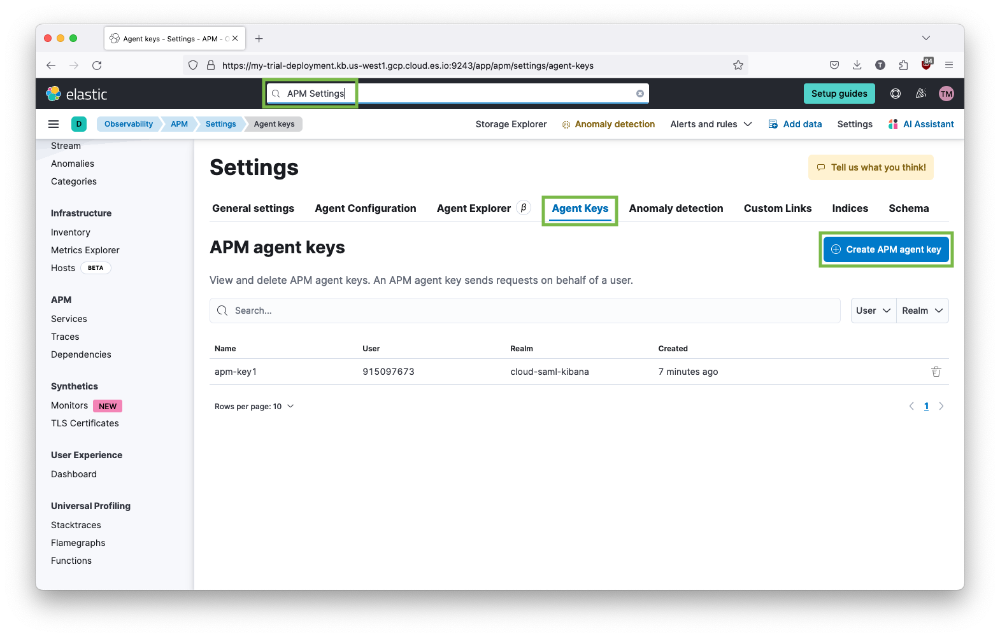

<!--
Goal of this doc:
Provide a complete reference of all available configuration options and where/how they can be set. (Any Elastic-specific configuration options are listed directly. General OpenTelemetry configuration options are linked.)

Assumptions we're comfortable making about the reader:
* They are familiar with Elastic
* They are familiar with OpenTelemetry
-->

# Configuration

> [!WARNING]
> The Elastic Distribution for OpenTelemetry Node.js is not yet recommended for production use. Functionality may be changed or removed in future releases. Alpha releases are not subject to the support SLA of official GA features.
>
> We welcome your feedback! You can reach us by [opening a GitHub issue](https://github.com/elastic/elastic-otel-node/issues) or starting a discussion thread on the [Elastic Discuss forum](https://discuss.elastic.co/tags/c/observability/apm/58/nodejs).

<!-- ✅ How users set configuration options -->
## Configuration method

Configuration of the OpenTelemetry SDK should be performed through the
mechanisms [documented on the OpenTelemetry website](https://opentelemetry.io/docs/languages/js/automatic/configuration/).
The distro can be further configured using advanced settings when you need complete control of its behavior.

<!-- ✅ How -->
The distro is typically configured with `OTEL_*` environment variables defined by the OpenTelemetry spec.
Environment variables are read at startup and can be used to configure the Elastic distribution.

The distro will send telemetry data via OpenTelemetry's protocol (OTLP) to the
configured endpoint (by default it sends to <http://localhost:4317>). The
endpoint can be changed by setting the following environment vars:

* `OTEL_EXPORTER_OTLP_ENDPOINT`: The full URL of the endpoint where data will be sent.
* `OTEL_EXPORTER_OTLP_HEADERS`: A comma-separated list of `key=value` pairs that will be added to the headers of every request. This is typically this is used for authentication information.

<!-- ✅ Example -->
For example, to send telemetry data to your Elastic Observability deployment you
might start the application like this:

```sh
export OTEL_EXPORTER_OTLP_ENDPOINT=https://{your-otlp-endpoint.example.com}
export OTEL_EXPORTER_OTLP_HEADERS="Authorization=Bearer {your-Elastic-secret-token}"
export OTEL_SERVICE_NAME=my-service
```

<!-- ✅ List all available configuration options -->
## Configuration options

Because the Elastic Distribution for OpenTelemetry Node.js ("the distro") is an extension of the [OpenTelemetry Node.js SDK](https://github.com/open-telemetry/opentelemetry-js/tree/main/experimental/packages/opentelemetry-sdk-node) and other OpenTelemetry JavaScript packages, it supports `OTEL_*` environment variables per the [OpenTelemetry Environment Variable](https://opentelemetry.io/docs/specs/otel/configuration/sdk-environment-variables/) spec.

<!--
TODO:
Are there Elastic-specific custom configuration options
in addition to the general OpenTelemetry SDK
configuration options? Or are all the customizations
"behind the scenes"?
If not, you can delete this section.

[discrete]
[[configure-distro-options]]
=== Elastic-specific configuration options

The distro supports the following Elastic-specific options:

(List config options)
-->

<!-- ✅ List auth methods -->
## Authentication methods

When sending data to Elastic, there are two ways you can authenticate: using a secret token or using an APM agent key.

### Use a secret token

<!-- ✅ What is this -->
<!-- ✅ Why use this -->
[Secret tokens](https://elastic.co/guide/en/observability/current/apm-secret-token.html) are used to authorize
requests to the APM Server. Both the distro and APM Server must be configured with the same secret token for
the request to be accepted.

<!-- ✅ How do you authenticate using this method? -->

You can find the values of these variables in Kibana's APM tutorial.
In Kibana:

1. Search for _APM Tutorial_.
1. Scroll down to the _APM Agents_ section and select the **OpenTelemetry** tab.
1. The appropriate values for `OTEL_EXPORTER_OTLP_ENDPOINT` and `OTEL_EXPORTER_OTLP_HEADERS` are shown there. For example:
    ```sh
    export OTEL_EXPORTER_OTLP_ENDPOINT=https://my-deployment.apm.us-west1.gcp.cloud.es.io
    export OTEL_EXPORTER_OTLP_HEADERS="Authorization=Bearer P....l"
    ```

### Use an APM agent key (API key)

<!-- ✅ What is this? -->
It is also possible to authenticate to an Elastic Observability endpoint using
an [APM agent key](https://elastic.co/guide/en/observability/current/apm-api-key.html).
These are revocable API keys.

<!--
TODO: Why would you choose this method?
Use this method only if it's enabled?
-->

<!-- ✅ How do you authenticate using this method? -->
To create and manage APM Agent keys in Kibana:

1. Go to **APM Settings**.
1. Select the **Agent Keys** tab.



When using an APM Agent key, the `OTEL_EXPORTER_OTLP_HEADERS` is set using a
different auth schema (`ApiKey` rather than `Bearer`). For example:

<!-- ✅ Code example -->
```sh
export OTEL_EXPORTER_OTLP_ENDPOINT=https://my-deployment.apm.us-west1.gcp.cloud.es.io
export OTEL_EXPORTER_OTLP_HEADERS="Authorization=ApiKey TkpXUkx...dVZGQQ=="
```
