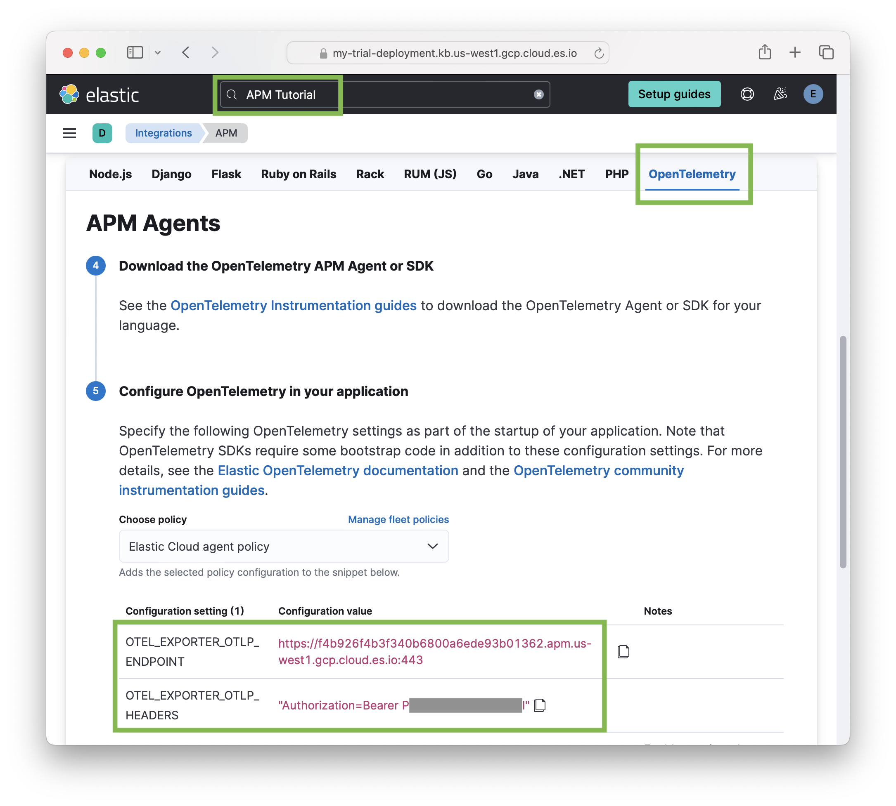

<DocBadge template="technical preview" />

This getting started guide will show how to use this Distro to instrument your Node.js application and send OpenTelemetry data to an Elastic Observability deployment. Note, however, that as an OpenTelemetry SDK, it supports sending data to any OTLP endpoint, e.g. an [OpenTelemetry Collector](https://opentelemetry.io/docs/collector/).

## Installation

```sh
npm install --save @elastic/opentelemetry-node
```

The Distro is a single package that includes all the OpenTelemetry JS packages
that are needed for most cases.

{/* TODO: refer to advanced section of "start the SDK" when we have that doc. */}

## Configuration

The Distro is a wrapper around the [OpenTelemetry Node.js SDK](https://github.com/open-telemetry/opentelemetry-js/tree/main/experimental/packages/opentelemetry-sdk-node)
and other OpenTelemetry JS packages. It is typically configured with `OTEL_*`
environment variables defined by the OpenTelemetry spec. The most common
configuration settings are `OTEL_EXPORTER_OTLP_*` to set the endpoint for
sending data and `OTEL_SERVICE_NAME` to identify your service.

The Distro will send telemetry data via OpenTelemetry's protocol (OTLP) to the
configured endpoint (by default it sends to `<http://localhost:4317>`). The
endpoint can be changed by setting the following environment vars:

- `OTEL_EXPORTER_OTLP_ENDPOINT`: full URL of the endpoint where to send the data
- `OTEL_EXPORTER_OTLP_HEADERS`: Comma-separated list of `key=value` pairs which
  will be added to the headers of every request. Typically this is used for
  authentication information.

For example, to send telemetry data to your Elastic Observability deployment you
might start the application like this:

```sh
export OTEL_EXPORTER_OTLP_ENDPOINT=https://{your-otlp-endpoint.example.com}
export OTEL_EXPORTER_OTLP_HEADERS="Authorization=Bearer {your-Elastic-secret-token}"
export OTEL_SERVICE_NAME=my-service
```

If you don't have an Elastic Observability deployment or don't have the
endpoint and auth data for your deployment, see the [Elastic Observability setup](#elastic-observability-setup)
section below.

See the [OpenTelemetry Environment Variable spec](https://opentelemetry.io/docs/specs/otel/configuration/sdk-environment-variables/) for other available configuration settings.

## Initialization

For the Distro to automatically instrument modules used by your Node.js service,
it must be started before your service code `require`s its dependencies --
e.g. before `express`, `http`, etc. are loaded. The recommended way to get the
Distro started is by using the `-r, --require` Node.js
[CLI option](https://nodejs.org/api/cli.html#-r---require-module).

```sh
node --require @elastic/opentelemetry-node my-service.js
```

The Distro will automatically instrument popular modules (see [supported instrumentations](./supported-technologies.md#instrumentations))
used by your service, and send traces, metrics, and logs telemetry data (using
OTLP) to your configured observability backend.

{/* TODO: link to a reference section on other ways to start the Distro once we have those docs. */}


## Elastic Observability setup

You'll need somewhere to send the gathered OpenTelemetry data, so it can be
viewed and analyzed. The `@elastic/opentelemetry-node` package supports sending
to any OTLP endpoint (e.g. an OpenTelemetry collector instance). This section
shows how to create an [Elastic Observability](https://www.elastic.co/observability)
cloud deployment and get the data you need to configure the Distro to send
data to it.

1. Register at [cloud.elastic.co](https://cloud.elastic.co/registration), if you haven't already. This supports starting **free trial**.

2. After registering, click "Create deployment" at `<https://cloud.elastic.co/home>`.  Once that is created, click "Open" to visit your Kibana home page, e.g. `https://{DEPLOYMENT_NAME}.kb.{REGION}.cloud.es.io/app/home#/getting_started`.

To configure the Distro you'll need the deployment's OTLP endpoint and
authorization data to set the appropriate `OTLP_*` environment variables. You
can find these in Kibana's APM tutorial.



3. In Kibana:

    - search for "APM Tutorial",
    - scroll down to the "APM Agents" section and select the "OpenTelemetry" tab,
    - the appropriate values for `OTEL_EXPORTER_OTLP_ENDPOINT` and
      `OTEL_EXPORTER_OTLP_HEADERS` are shown there.

    For example:

    ```
    export OTEL_EXPORTER_OTLP_ENDPOINT=https://my-deployment.apm.us-west1.gcp.cloud.es.io
    export OTEL_EXPORTER_OTLP_HEADERS="Authorization=Bearer P....l"
    ```

Use these environment variables in the [Configuration](#configuration) step
above to configure the Distro.

### Authenticate using an APM Agent key (API key)

It is also possible to authenticate to an Elastic Observability endpoint using
an "APM Agent key". These are revocable API keys. To create and manage
APM Agent keys, see the "Agent Keys" tab in "APM Settings" in Kibana.


When using an APM Agent key, the `OTEL_EXPORTER_OTLP_HEADERS` is set using a
different auth schema (`ApiKey` rather than `Bearer`). For example:

```
export OTEL_EXPORTER_OTLP_ENDPOINT=https://my-deployment.apm.us-west1.gcp.cloud.es.io
export OTEL_EXPORTER_OTLP_HEADERS="Authorization=ApiKey TkpXUkx...dVZGQQ=="
```
